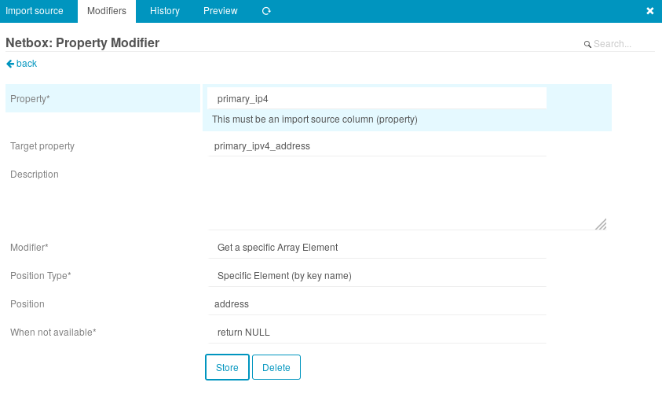
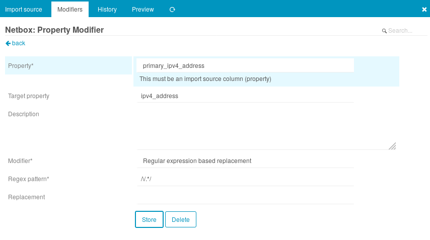

# Icinga Web 2 Netbox Import

Import devices and virtual machines from [netbox](https://github.com/digitalocean/netbox)
into icinga2 to monitor them.

## Installation

```shell
$ cd /usr/share/icingaweb2/modules
$ git clone https://github.com/Uberspace/icingaweb2-module-netboximport.git netboximport
$ icingacli module enable netboximport
```

## Configuration

All configuration is done in the web interface under the "Automation" tab of
icinga2 director. Please read to the [official documentation](https://www.icinga.com/docs/director/latest/doc/70-Import-and-Sync/)
before configuring a netbox import.

1. add an "Import Source"
  * Key column name: `name` (the hostname)
  * fill out all other required files according to the tooltips shown
2. test the Import source via the "Check for changes" button, "Preview" tab and finally "Trigger Import Run"
3. add a "Sync Rule"
  * Object Type: "Host"
  * by default will import _all_ objects present in netbox. You can tailor this by setting "Filter".
    For example, only import objects, which have a certain field set: `custom_fields__icinga2_host_template__label>0`.
4. add the desired Properties to the rule
  * setting `object_name`, `address` and `address6` to `name` is generally desireable
5. test the Sync Rule via the "Check for changes" and finally "Trigger this Sync" buttons.
6. add an import job to run the import regularly
7. add an sync job to run the sync regularly

## Data Format

This plugin pulls all available objects with all their fields into icinga. Since
the data in netbox mostly consists of nested objects, you will either have to autoflatten (default for custom_fields and interfaces) the elements or you have to apply the "Get specific Array Element" modifier to deconstruct the objects.
and access the object elements:

primary_ip4:
```yml
{
  address: "192.168.0.1/24",
  family: 4,
  id: 1,
  url: "<NETBOX URL>"
}
```

Apply modifier to export address field:



Because Icinga2 does not like the format Netbox uses (/subnet appended to address), we need to strip this away with another modifier:



Now you can access the primary_ipv4 directly as a property
:arrow_right:

```yml
ipv4_address: "192.168.0.1"
```

A list of all possible fields can be seen in the "Preview" of your Import Source,
in your Sync Rule while adding a new property or in your API itself: https://netbox.example.com/api/dcim/devices/,
https://netbox.example.com/api/virtualization/virtual-machines/.

In some cases additional fields are provided:

* `cluster` is replaced by the actual cluster object as returned by the API,
  instead of just the id/name.
* `interfaces` is added, so configured IP addresses can be reused in icinga
* `services` is added, so configured services can be reused in icinga

### Tag split delimiter
A Tag in netbox is only one value. But if your tags are imported by different hyperscaler, you have often a key value pair. So if you import this key value pair into netbox you have to chose a delimiter. In our case tags a are like:
````
thisisatag::true
````
<<<<<<< HEAD
To Work with the key and the value in icinga2, you need a json hash. If you have a different delimiter, you can set this here.
=======
To Work with the key and the value in icinga2, you need a json hash. If you have a different delimiter, you can set this herre.
>>>>>>> af5452cf085b7b56cda9f87f53156cbbd00a12df
If you have no delimiter, you can ignore this field.

## Acknowledgements

The general structure and a few tips were lifted from [icingaweb2-module-fileshipper](https://github.com/Icinga/icingaweb2-module-fileshipper).
Thanks!
